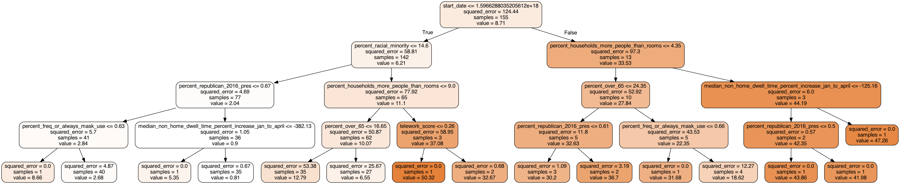

# who-can-social-distance

This repository contains the code, visualizations, presentations, final paper for my Gonzaga University Honors college senior thesis which investigated the effects of socioeconomic and behavioral factors on the spread of COVID-19. Some code is not included in this repository as it relied on private APIs or data repository that I was able to access from within Talus Analytics.

# Table of contents

- [reports](/reports)

  - The paper, presentation, and figures created for this project

  - [thesis](reports/Ciara_Patterson_Thesis_April_16_2021.pdf)

  - [presentation](reports/Thesis_Presentation.pptx)

  - [figures](/reports/figures)

- [data](/data)

  - The data used in this project. It's either in its raw form, edited manually, pre-processed (iterim), or processed completely for machine learning.

  - [edited](/data/edited/)

  - [interim](/data/intermin)

  - [processed](/data/processed)

  - [raw](/data/raw)

- [notebooks](/notebooks)

  - Jupter Notebooks created to analyze this data. One contains the final model and the other has exploratory data analysis.

  - [exploratory_data_analysis.ipynb](/notebooks/exploratory_data_analysis.ipynb)

  - [models.ipynb](/notebooks/models.ipynb)

- [src](/src)

  - Source code for creating the dataset, visualizations, and models

  - _Still in the process of documentating according to Google Style_

  - [data](/src/data)

    - [visualize.py](/src/data/visualize.py)

  - [models](/src/models)

    - [train_and_test_model.py](/src/data/train_and_test_model.py)

  - [visualization](/src/visualization)
    - [visualize.py](/src/data/visualize.py)

# Project goal

In creating this project, I tried to understand why the success of policy restrictions had varied so widely across the US. No two regions appeared to respond to stay at home orders the same. Whereas, one county might see case sky-rocket following the closure of indoor dining, another might see them gradually fall. I suspected that this had to to with the both the willingness and the ability of people to comply with mitigation policy.

# Method

To test this hypothesis, I identifed a set of counties with similar policy restrictions using [COVID-AMP](https://covidamp.org/). I then collected and combined a wide variety of data on that county's inhabitants including cell-phone mobility data, income, racial and ethnic identification, and teleworking ability. I then attempted to train a machine learning to predict the average caseload observed while the policy was in place given that information about the counties inhabitants.

I ultimately used a random forest algorithm.

# Results

To stop the model from using the time of year to estimate caseload, I split the larger dataset into a spring and fall dataset. On the spring dataset, the model was able to predict the number of COVID-19 cases observed while the policy was in place within an absolute mean error of 3.6 cases per 100,000 people, and the model was able to explain ~40-50% of the variance in the test set $(R^{2}=0.41, OOB = 0.48)$.

_scatter.png>)

Race and household crowdedness were the two most important features in creating the final model prediction.

From our exploratory data analysis, we know that those two features, like many of the features in our dataset are highly correlated, making it difficult to discern which was most important.

However, it seems likely that our model frequently relied on the racial makeup of a county in making its prediction in part because in the US race is highly correlated with access to healthcare, likelihood to be an essential worker, household crowdedness, and other factors that may affect COVID-19 outcomes.

For a more in-depth discussion of the process and results, the final presentation and paper that resulted from this project have been included in reports.
